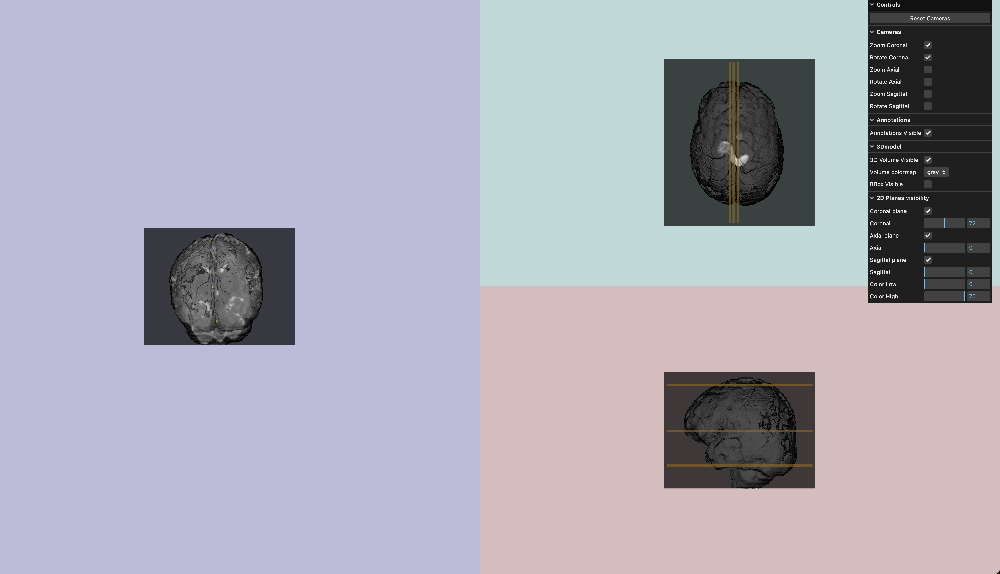
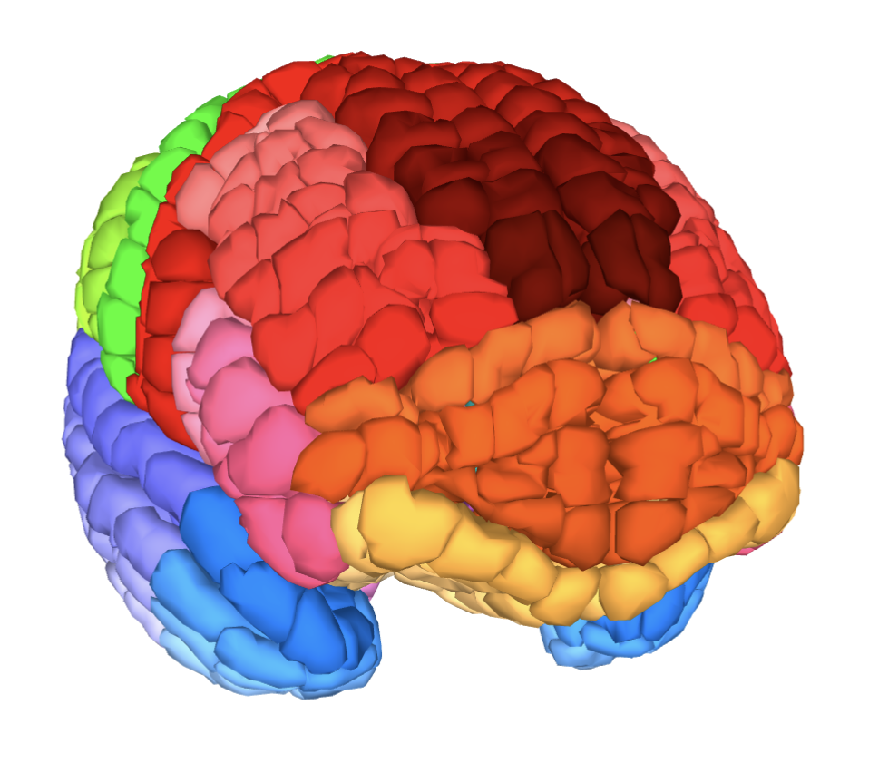

In this project, I explored the visualization of volumetric brain data. A custom light-weight tool that lets users efficiently view and interact with clinical volumetric files, providing insights into complex 3D structures through various perspectives and useful functionalities. 

## Highlights

* 3D Volume Visualization: visualization of volumetric data in a three-dimensional space, for a quick and comprehensive view of the data.
* Plane navigation, like in the standard brain viewer.
* Annotation Rendering: read custom annotations from external files and integrate them into the volumes.
* Flexibility of the views and renders, with direct discussion with clinicians. 
## Ideas
See brain file and play with it.  
Or, visualize brain annotations and detected anomalies from the models.  
Keep it simple !
  

 

  

## My Thoughts

> * More than a deliverable, I used the tool during all my experiments with MRI dataset.
> * Fun with Javascript! Keeps improving over time as I use [Three.js](https://threejs.org/) better

