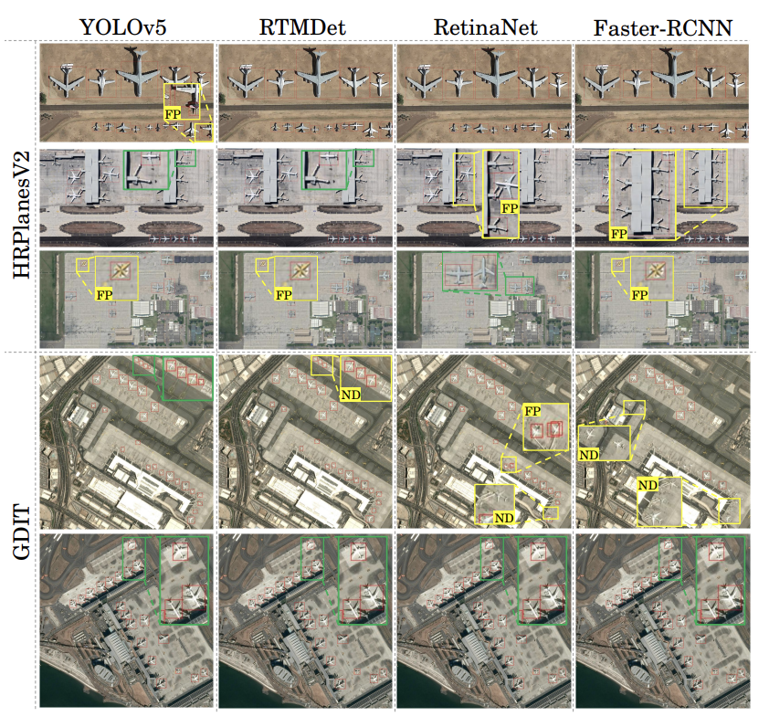

[**Computer Vision**] [**Object Detection**] [**PyTorch**] [**TensorFlow**]
  
This study compared multiple deep learning algorithms, including `Faster RCNN`, `DETR`, `SSD`, `RTMdet`, `RetinaNet`, `CenterNet`, `YOLOv5`, and `YOLOv8`, trained and evaluated on aerial images for the detection and localization of aircrafts. 

## Highlights

* Due to the fine-tuning, newer is not always better, Yolov5 came out on top.
* Deep dive in satellite imaging world, a lot of images and datasets, and a lot of models applicable. 
* Ensemble or voting methods are important when not missing out detections is important.  

The graphical summary of the work is presented if the following figure : 

  

## My Thoughts
 
> * Object Detection is rapidly evolving, we are not at yolov12 and this was done with yolov8 as the best SOTA.
> * This was done in collaboration with Switzerland defense agencies, really cool to be able to use our expertise! 
> * So much more to do with satellites images, segmentations, classifications, and now combined with VLMs it only gets better. 