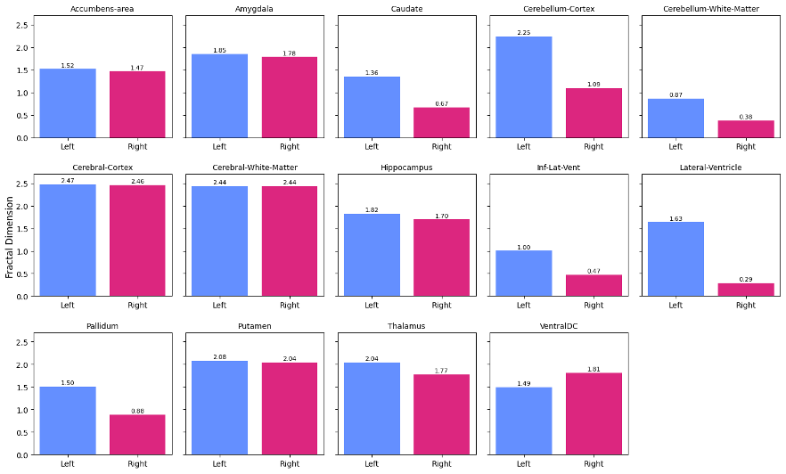

> [**3D Brain MRI**] [**Fractal Dimension**] [**Developmental Curves**] [**3D Segmentation Models**] [**PyTorch**]

This study in development aims to analyze the fractal dimension (FD) of various brain regions in children to understand how these dimensions change with age, establishing developmental trajectories for typical brain maturation.
Findings could help in the early detection of developmental abnormalities.
## Highlights and Ideas

* Combination of models after MRI registration. Skull stripping + segmentation models accuracies impact on fractal dimension is assessed.
* Considering that the box-counting method is the most widely used, what constitutes the optimal range of box sizes for estimating the fractal dimension? 
* Do different datasets necessitate distinct developmental curves, or is it possible to develop generalisable models?
* Comparison of using different 3D segmentation models for the brain parts extraction vs training/fine-tuning models.

  

  

## My Thoughts

  

> * The focus on brain development from the newborn stage using fractal analysis is genuinely cool and not broadly explored yet.
> * The plan to assess the impact of segmentation accuracy is crucial for results evaluation and I enjoy making different types of models work. 
> * Cool visualisations with the developmental curves are expected.