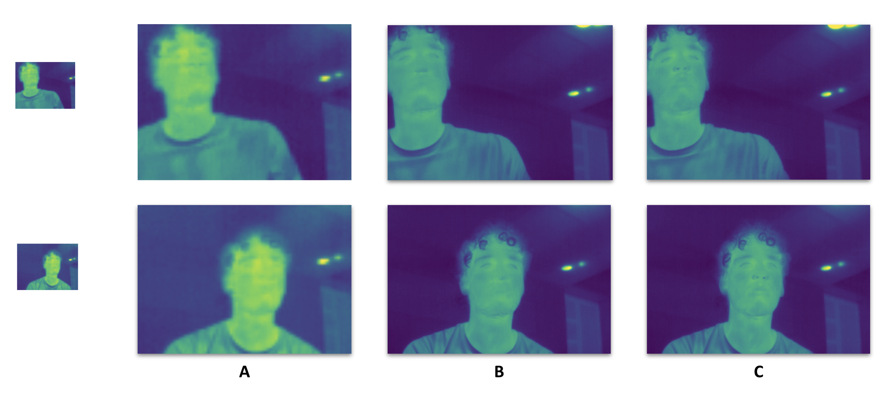

> [**GAN**] **[Software Development]** **[Thermal Images]** **[PyTorch]** 

In this project, with partners from `SUPSI` and `Next2U Solutions`, I am responsible for the development of an embedded super-resolution module. 
The solution is a customized and reduced-size GAN, to be executable on a Jetson Nano.

The idea of the project is to revolutionize the application of affective computing, being able to bring under a single and miniaturized, sensing module all the power of the Facial Expression Analysis, of the most advanced non-contact psychophysiology, and of specifically developed intelligence machinery able to learn from the memory of previous experiences and affective states.

## Highlights

* Tests on GPU v CPU v TPU, code flexibility for quick benchmarks.
* Reached 25 fps output for resolution from 120x160 to 240x320. 
* Collects the binary frames from the camera and outputs frames for the following model of landmark detection.
* Final evaluation on the effective improvement of the SR model for the landmarks detections.  

The table summarizes the FPS output obtained with different versions and setup : 
| **Version** | **GPU** | **CPU** | **TPU**
| ------ | ----- | ----- | ----- |
| V0 | 168 | 108 | 15 | 
| V1 | 171 | 115 | 18 | 
| V2 | 175 | 129 | 25 | 

(The implementation code is currently under NDA)

## My Thoughts

> * Improvements from V0-2 came from changes in the frame by frame processing and threading.  
> * Concrete implementation of ML into software development,  challenging fun!

