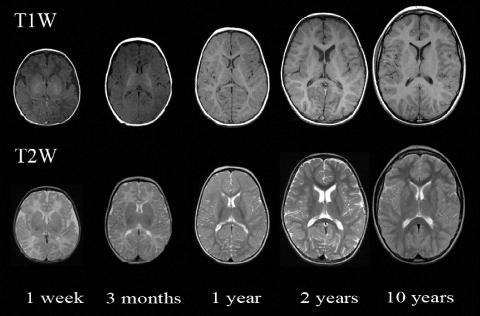
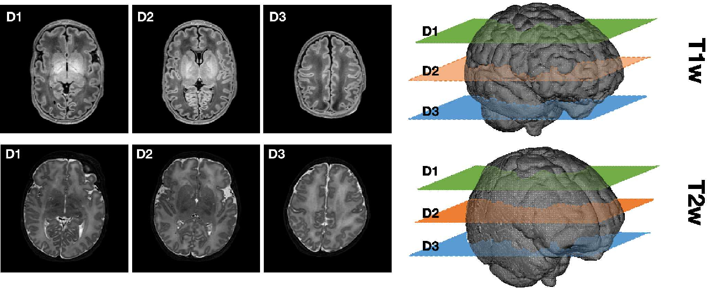

> [**Computer Vision**] [**CNN**] [**Transformer**] [**3D**][**TensorFlow**] [**PyTorch**] [**HF Dataset**] [**VLM**]

As part of the PARENTH2020 Consortium, my Thesis goal was to question possible applications of AI for the diagnosis or prognosis of premature born infants. After a few direction changes, my work focuses on the study of asymmetries in the newborn brain. Early detection of lesion, and asymmetrical ones in particular, would allow precision care and developmental monitoring of newborns.  

## Research Questions and Projects

* Interdisciplinary research programme 
* Research on the evaluation of symmetry in the brain using Computer Vision
* Symmetry properties and Fractal Dimension of the brain, how do they evolve ?
* Complete Deep Learning pipeline from scan to lesion detection
* 3D Visualizer in javascript for model development and radiologists use cases
* Exploration of MRI datasets and annotations tools
* Fine-tuning of VLM for performance evaluation "*VLM vs radiologist*" 

  

  

## My Thoughts
  
> * My favourite part is getting the hand of MRI datasets and using/fine-tuning CV models within an entire pipeline, while discussing these with the hospital doctors.
> * The more I tried CV models, the better the LLMs got, so my final chapter will concern the implementation of LLMs for clinical decision support.
> * Working in applied research to improve clinical care is a plus I love !