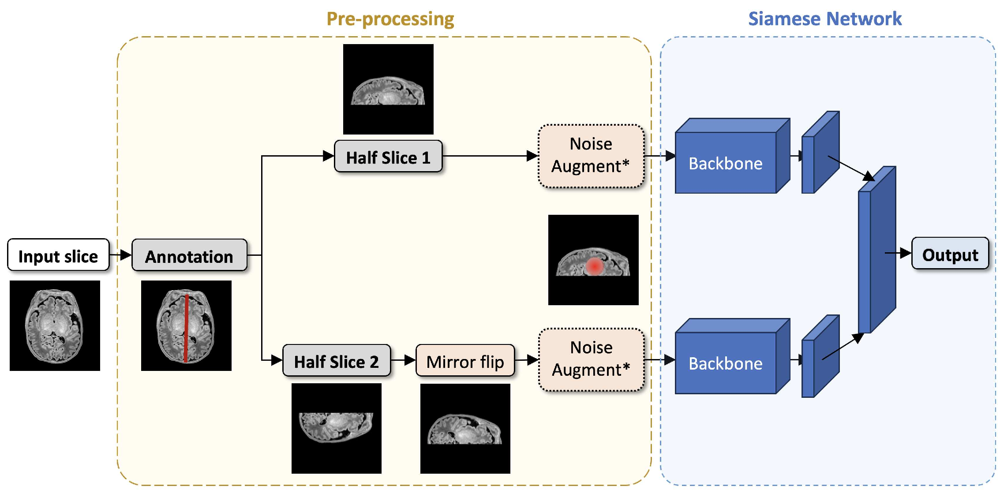

> [**Computer Vision**] [**CNN**] [**PyTorch**] [**HF Dataset**]
  

## Highlights

* Used an open MRI source to create and annotate my own [2D dataset](https://huggingface.co/datasets/agucci/mri-sym2) + tested simulated tumors. 
* Compared 5 Siamese network backbones (ResNet, ResNeXt, MobileNet, VGG, EfficientNet) for symmetry analysis in neonatal brain MRIs.
* VGG-based networks outperformed others faster, achieving up to 99% detection accuracy for larger asymmetries and demonstrating strong generalization.
* Networks showed variable sensitivity based on asymmetry size; models trained on medium-sized asymmetries generalized best across different scales.
* Groundwork for automated early detection of developmental abnormalities, with on-going similar project but using 3D model directly. 

## Ideas

The aim was to evaluate specific CNN architectures to detect brain abnormalities in newborns, analyzing how symmetrical (or not) their brain images are. The _Siamese neural network_, compares the left and right sides of the brain to spot differences. A new dataset had to be created and curated for the project.
By adding fake but controlled asymmetries (small differences) to brain images, we used healthy datasets. Helping the models generalize.

## My Thoughts

  

> * Had a lot of fun with the PyTorch loops and controlled noise creation!
> * While not ground-breaking, this proved useful to understand which models and what are (were) the limitations from a Computer Science perspective.
> * Excited to see the results of the 3D version (writing/testing phase). 